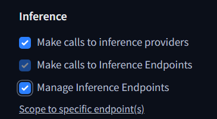

# Team Hugging Face

# In-class Demo

## Members

1. Susana Cajavilca Turco
2. Emilio Sebastian Conde Ludena
3. Avneet Kaur
4. Toshit Narwal

## Goal of the In-class Demo

The goal of this repo is to familiarize our classmates with [HuggingFace](https://huggingface.co) by creating a single page Web App with a text generator that receives input from the user and generates and answer using the model: "google/gemma-2-2b-it".

## Follow this steps to achieve it:

1. Create folder in your local directory and name it TestHuggingFace.
2. Open Visual Studio Code. Click on explorer. Right click on workspace and click on Add Folder To Workspace. Find folder created on Step 1 and add it.
3. On Visual Studio Code. Click on Tab Terminal and select New Terminal. Select folder from Step 1.
4. Run the following commands in the terminal:

```
   - npx express-generator --view=hbs
   - npm install @huggingface/inference dotenv
   - npm audit fix --force
```

5. The result in the terminal will be 0 vulnerabilities. On your folder check package.json for the following "dependencies": { "@huggingface/inference"; "dotenv" ; "express"}
6. Navigate to [HuggingFace Join](https://huggingface.co/join). Confirm that your are a human. Enter your email address and password. Complete your profile, you only have to fill the Username with a unique name and your Full name, check on terms and services and click Create Account. Skip avatar. Go to your email and confirm your identity for HuggingFace. Go back to Hugging Face main page click on top right corner and click Access Tokens. Create New Access Token. Name the tokes as TestHuggingFace and below inference check the three boxes available.
   .
   Click create token. Copy token and saved it in a file outside the folder. Once you click Done, you cannot retrieve back the token.
7. Create .env file at the TestHuggingFace folder level. Inside .env file write:

```
 ACCESS_TOKEN=PasteTokenInsteadOfText
```

[!CAUTION]
write the token you got from step 6 instead of PasteTokenInsteadOfText.

8. Create folder configs, inside configs create access.js file. Inside access file write code below:

```
require("dotenv").config();
const accessToken = process.env.ACCESS_TOKEN;

//export the configuration object
module.exports = accessToken;

```

9. Click on views, click on index hbs. Paste the following code below:

```
<section class="container">
  <h2>Generating Text</h2>
  <div>
    <label for="textEntered">Enter text below:</label>
    <input type="text" id="textEntered" placeholder="Enter Text" />
    <button class="btn-custom mt-3 w-100" id="generateTextButton">Generate Story</button>
  </div>
  <div>
    <p id="generatedText">Text will appear here:</p>
  </div>
</section>

<script src="javascripts/script.js"></script>
```

10. Click on public/stylesheet/style.css Paste code below:

```
body {
  font-family: Arial, sans-serif;
  display: flex;
  justify-content: center;
  align-items: center;
  height: 100vh;
  margin: 0;
  background-color: #f0f0f0;
}

.container {
  text-align: center;
  max-width: 600px;
  width: 100%;
}

input {
  width: 80%;
  padding: 10px;
  margin-top: 20px;
  font-size: 16px;
}

button {
  padding: 10px 20px;
  font-size: 16px;
  background-color: #4CAF50;
  color: white;
  border: none;
  cursor: pointer;
  margin-top: 10px;
}

button:hover {
  background-color: #45a049;
}
```

11. Click on public/javascripts. Create new file named it script.js. Paste code below in the file:

```
//target html elements for id
const generateTextButton = document.getElementById("generateTextButton");
const generatedText = document.getElementById("generatedText");
const textEntered = document.getElementById("textEntered");

// Function to show loading text
const showLoading = () => {
  generatedText.innerHTML = "loading...."; //
};

//event listener for button click
generateTextButton.addEventListener("click", async () => {
  const questionTextEntered = textEntered.value.trim(); //get value from input field

  // validations
  if (!questionTextEntered) {
    generatedText.innerHTML = "Enter Text here";
    return;
  }

  if (questionTextEntered.length < 5) {
    generatedText.innerHTML = "Text must be at least 5 characters long.";
    return;
  }

  try {
    showLoading(); // Show loading state

    const response = await fetch("/text-generator", {
      method: "POST",
      headers: {
        "Content-Type": "application/json",
      },
      body: JSON.stringify({ question: questionTextEntered }), //question to server
    });

    if (response.ok) {
      // If the response is successful, parse the JSON data
      const data = await response.json();
      console.log(data); // Handle the generated text here
      generatedText.textContent = data; // assign html value to p tag
    } else {
      // If there's an error with the request, log the error
      console.error("Error:", response.status, response.statusText);
    }
  } catch (error) {
    console.error("Error", error);
    generatedText.textContent = "Error, Please try again!";
  }
});

```

12. Click on routes/index.js. Erase all and paste code below in file:

```
var express = require("express");
var router = express.Router();
const { HfInference } = require("@huggingface/inference");
const accessToken = require("../configs/access");

/* GET home page. */
router.get("/", function (req, res, next) {
  res.render("index", { title: "Express" });
});

router.post("/text-generator", async (req, res) => {
  try {
    const question = req.body.question;
    const client = new HfInference(accessToken);

    const chatCompletion = await client.chatCompletion({
      model: "google/gemma-2-2b-it",
      messages: [
        {
          role: "user",
          content: question,
        },
      ],
      provider: "hf-inference",
      max_tokens: 500,
    });

    const chatCompletionGeneratedText =
      chatCompletion.choices[0].message.content;

    res.json(chatCompletionGeneratedText);
  } catch (error) {
    console.error("Error generating prediction:", error);
    res.status(500).json({ error: "Failed to generate prediction" });
  }
});

module.exports = router;

```

13. Now rum npm start on terminal. Navigate http://localhost:3000/. Input a question and click button, you will receive a reply from AI.
